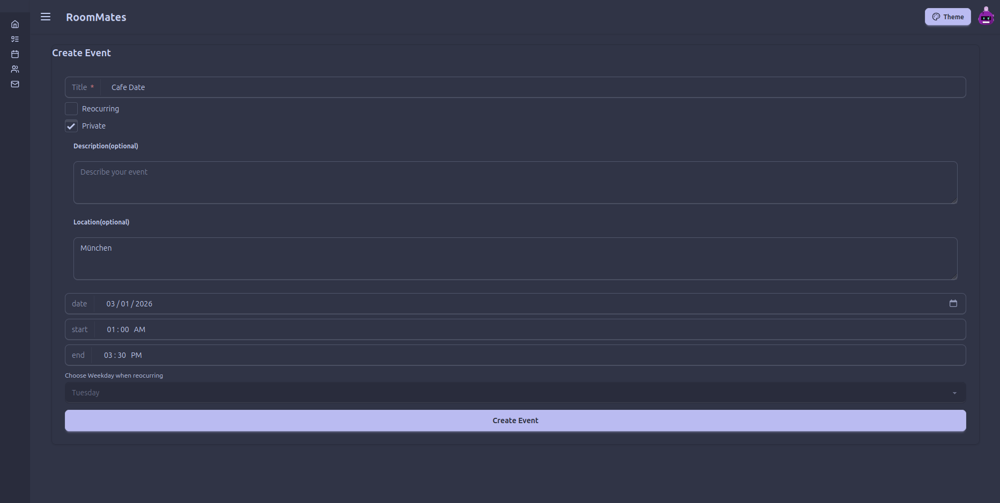
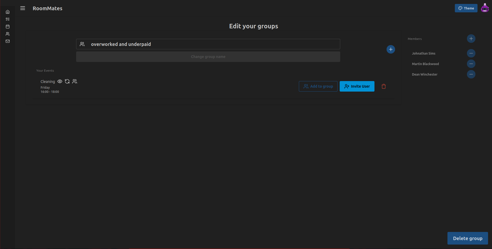
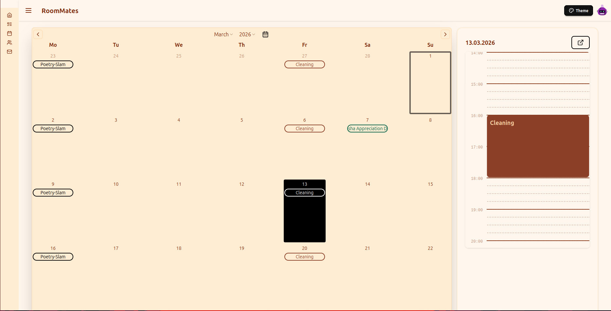
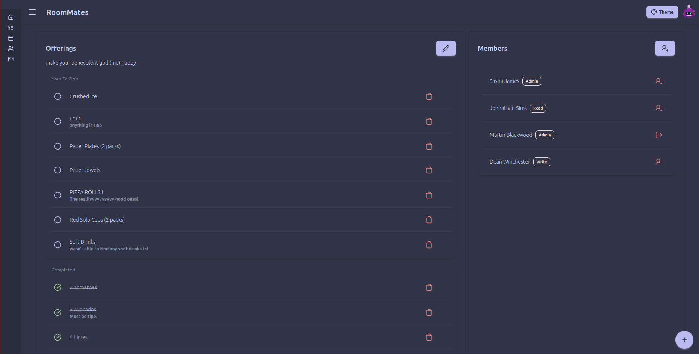
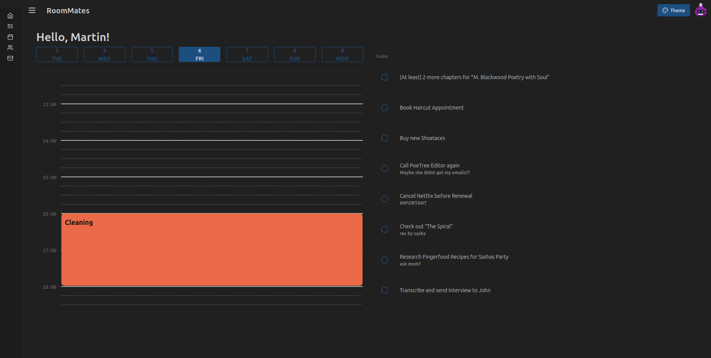
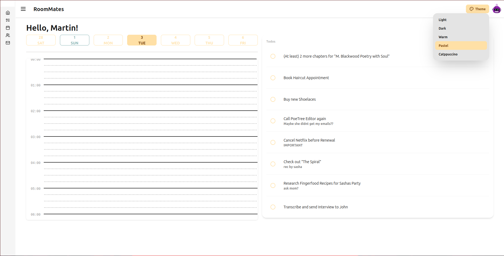

<p align="center">
  
</p>
<h1 align="center">@SFSeeger/RoomMates</h1>
<p align="center">
  Making organizing easy
</p>

<details open>
<summary><h2>Table of Contents</h2></summary>

- [Features](#features)
- [Deployment](#deployment)
    - [Server](#server)
        - [Server with Sqlite Database](#server-with-sqlite-database)
        - [Server with MySQL/MariaDB](#server-with-mysqlmariadb)
        - [OIDC Support](#oidc-support)
    - [Clients](#clients)
        - [Android](#android)
    - [Tools and Dependencies](#tools-and-dependencies)
- [Development](#development)
    - [Project Structure](#project-structure)
    - [Serving Your App](#serving-your-app)
    - [Development Services](#development-services)
    - [Dev Container](#dev-container)
    - [Pre-Commit Hooks](#pre-commit-hooks)
    - [Testing](#testing)
- [Disclosure of AI Usage](#disclosure-of-ai-usage)

</details>

## Features

* Create, view and share Events with groups and individual users
  
  
  
* Manage and collaborate on To-Do Lists with different permissions
  
* Choose from multiple themes to personalize your experience
  
  
* Compatible with both MySQL and SQLite databases
* Cross-Platform Support ([See Clients](#clients))
* OIDC Support

## Deployment

### Server

To deploy the server use the provided `Dockerfile` to build a docker image serving both frontend and api. This requires
docker on your machine and the server.

#### Server with Sqlite Database

```bash
docker run -d -p 8080:8080 \
  -e DATABASE_URL="sqlite://db/db.sqlite?mode=rwc" \
  -e ACCESS_LOG=true \
  -v database:/app/db/ \
  --name roommates-server \
  ghcr.io/sfseeger/roommates:latest
```

#### Server with MySQL/MariaDB

Create a `docker-compose.yml` file with the following content:

```yaml
services:
  db:
    image: mariadb
    environment:
      MYSQL_ROOT_PASSWORD: ${MYSQL_ROOT_PASSWORD}
      MYSQL_DATABASE: roommates
      MYSQL_USER: roommates
      MYSQL_PASSWORD: ${MYSQL_PASSWORD}
    volumes:
      - db_data:/var/lib/mysql

  roommates-server:
    image: ghcr.io/sfseeger/roommates:latest
    restart: unless-stopped
    ports:
      - "8080:8080"
    environment:
      DATABASE_URL: "mysql://roommates:${MYSQL_PASSWORD}@db:3306/roommates"
      ACCESS_LOG: true # Optional shows a access log in stdout
    depends_on:
      - db

volumes:
  db_data:
```

And a `.env` file like this in the same directory:

```shell
MYSQL_PASSWORD = <super secret password>
MYSQL_ROOT_PASSWORD = <super secret password 2>
```

Then run:

````shell
docker compose --env-file .env up -d
````

#### OIDC Support

RoomMates supports OIDC using the [openidconnect crate](https://docs.rs/openidconnect/latest/openidconnect/).
OIDC is not enabled by default and can be configured using the following Environment Variables:

|   Enviroment Variable Name    | Description                                                                                                                                                      |      Required      |
|:-----------------------------:|------------------------------------------------------------------------------------------------------------------------------------------------------------------|:------------------:|
|        `OIDC_ENABLED`         | Controls wether OIDC is enabled or not                                                                                                                           | :white_check_mark: |
|       `OIDC_ISSUER_URL`       | Url to the Issuer. Gets used to retrieve the required Metadata using the .well-known endpoint                                                                    | :white_check_mark: |
|       `OIDC_CLIENT_ID`        | Client ID used to authenticate against                                                                                                                           | :white_check_mark: |
|     `OIDC_CLIENT_SECRET`      | Client Secret for the supplied client                                                                                                                            | :white_check_mark: |
|         `SERVER_URL`          | Domain where the server is deployed. Used for redirection after the OIDC flow is compleated                                                                      | :white_check_mark: |
|       `SIGNUP_ENABLED`        | Controls wether users can create an account using the signup provided by RoomMates. OIDC accounds will always be created                                         |        :x:         |
|         `OIDC_SCOPES`         | Scopes the application has access to. Note that the application needs at least the email as well as the given and family name Defaults to `email profile openid` |        :x:         |
|      `OIDC_PROVIDE_NAME`      | The name of the provider displayed in the login form. Defauls to SSO                                                                                             |        :x:         |
| `OIDC_JWKS_REFRESH_INTERVALL` | Intervall in secounds when to reload the jwks used to validate auth tokens.                                                                                      |        :x:         |
|        `OIDC_AUDIENCE`        | Comma seperated list of audiences (e.g. `account,app`)                                                                                                           |        :x:         |

### Clients

Bundling the following targets have been tested. While bundling untested targets may work, there is a chance they
require additional configuration.

- [X] Web
- [X] Linux
- [ ] Windows
- [ ] macOS
- [X] Android
- [ ] iOS

To bundle clients for production, install the [required tools](#tools-and-dependencies) or use the devcontainer.
Then choose the platform you want to bundle and optionally
the [package type](https://dioxuslabs.com/learn/0.7/tutorial/bundle#bundling-for-desktop-and-mobile).
Run the following command in the root of the project[^1]:
> [!IMPORTANT]
> `SERVER_URL` should be the URL of your deployed server. Defaults to `http://localhost:8080`.

> [!TIP]
> You can also bundle the server this way, if you don't want to use docker. In this case set `PLATFORM` to web. You can
> omit `SERVER_URL` as it is not needed for the web platform.

```shell
make bundle PLATFORM=<platform> SERVER_URL="<your-server-url>" [PACKAGES="<package1> [<package2> ...]"]
```

#### Android

> [!IMPORTANT]
> This bundling config assumes you have a valid keystore in `~/.android/keystore.jks`. You can override the keystore
> location by using the `KEYSTORE_PATH` argument when bundling.
> Refer to [the android docs](https://developer.android.com/studio/publish/app-signing) on how to create one

> [!NOTE]
> This creates a `.apk` file for sideloading. The `.aab` bundle created by dioxus does not include the app icon

```shell
make bundle PLATFORM=android SERVER_URL="<your-server-url>" KEYSTORE_PASSWORD="<your-keystore-password>"
```

### Tools and Dependencies

For bundling, refer to
the [Dioxus documentation](https://dioxuslabs.com/learn/0.7/getting_started/#platform-specific-dependencies) for the
platform you want to bundle for.
Additionally you need:

* `The Rust toolchain`
* `Dioxus CLI`:
  [See installation instructions](https://dioxuslabs.com/learn/0.7/getting_started/#install-the-dioxus-cli)
* `Node` and `npm`
* `make`

## Development

### Project Structure

```
packages/
├── api/ # Everything that the server needs to handle goes here
│   ├── Cargo.toml
│   └── src/
│       ├── lib.rs
│       ├── routes/ # Api routes
│       └── server/ # Server specific code not to be compiled into frontend
├── entity/ # Collection of database entities
│   ├── Cargo.toml
│   └── src/
│       ├── lib.rs
│       ├── prelude.rs # Reexports of database entities
│       └── ...
├── form_hooks/ # Package providing utilities for handling forms
│   ├── Cargo.toml
│   ├── form_hooks_derive/ # Package providing derive macros for form traits
│   └── src/
└── frontend/
    ├── assets/ # Any assets that are used by the app should be placed here
    ├── Cargo.toml
    ├── src/
    │   ├── components/ # Collection of reusable components
    │   ├── main.rs # The entrypoint for the app. It also defines the routes for the app
    │   └── views/ # The views each route will render in the app
    └── tailwind.css
```

Modules in `routes` and `views` should be equal the URL structure. The API Route `/api/users/some-action` should be in a
module called `some_action` that is part of the `users` module. The full path of the route would be
`routes/users/some-action.rs`.

### Serving Your App

Run the following command in the root of your project to start developing with the default platform:

```bash
make dev-server
```

To run for a different platform, use the `PLATFORM` flag. E.g.

```bash
make dev-server PLATFORM=desktop
```

### Development Services

The RoomMates Dev Container uses a `traefik` to route to all required services. For this to work, you need to extend
your `/etc/hosts` (Linux / MacOS) `%windir%\system32\drivers\etc` (Windows) with these lines:

```text
127.0.0.1        roommates.local
127.0.0.1        auth.roommates.local
127.0.0.1        db.roommates.local
127.0.0.1        traefik.roommates.local
```

|          Domain           | Service       | Description                                           |
|:-------------------------:|:--------------|-------------------------------------------------------|
|     `roommates.local`     | Dev Container | Forwards port 8080                                    |
|  `auth.roommates.local`   | Keycloak      | Auth Provider for OIDC                                |
|   `db.roommates.local`    | PhpMyAdmin    | Database Frontend                                     |
| `traefik.roommates.local` | Traefik       | Used to access `traefik` dashboard under `/dashboard` |

If you want to use OIDC in the development, you also need to create a User in the Keycloak. For this, open
`auth.roommates.local` and login using the username `admin` with password `password`.
Then click `Manage Realms > RoomMates`. Once you are in the RoomMates Realm navigate to `Users > Create new User`.
After entering an email, first name and last name, open the tab `Credentials` and set a password. Make sure to disable
`temporary`, otherwise you'll need to change it on first login.

### Dev Container

1. Setup [Docker Desktop](https://www.docker.com/products/docker-desktop/)
1. Open this project in [Visual Studio Code](https://code.visualstudio.com/)
1. A popup should open prompting you to `Reopen in Container`. In case this does not happen use <kbd>Ctrl</kbd>+<kbd>
   Shift</kbd>+<kbd>P</kbd> (<kbd>⌘</kbd>+<kbd>⇧</kbd>+<kbd>P</kbd> on macOS) and type / select
   `> Dev Containers: Reopen in Container`

### Pre-Commit Hooks

We use pre-commit hooks to ensure consistent formatting and code quality in the project. `pre-commit` and the hooks
should already be installed in the devcontainer.

### Testing

Test Disclaimer:

Some tests for basic and advanced database logic were done using unit tests. However later on, most tests were conducted
by directly running and using the project, since a lot of the work was concerning the UI. Additionally most of the
database operations are pretty similar, so in the interest of saving time, there was not a need to write individual
tests for every one of them. The focus was on working directly with the interactive components of the project, seeing
what worked and gaining concrete information about occurring errors through example data and debugging with developer
tools.

To run the tests for the project, use the following command:

```bash
make tests
```

## Disclosure of AI Usage

AI was used for Tab-Completing and Debugging, never for generating whole sections of code without a human creating
derivatives of said generated code.
Model used were:

- ChatGPT 4o, 4.1 and 5
- Github Copilot
- Google Gemini

[^1]: Angle brackets (`<>`) indicate required arguments, square brackets (`[]`) indicate optional arguments.
